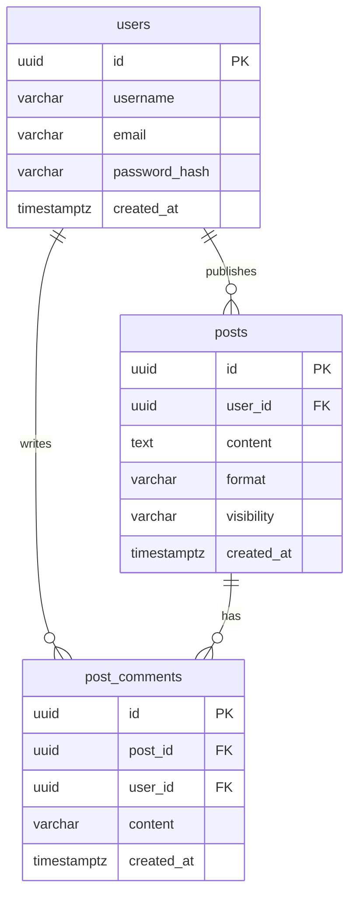

# Backend y base de datos — Goi (Fase 7)

Documento teórico del **Goi Server**: por qué existe un backend propio, cómo se relacionan **Goi App**, **Goi Web**, la **API REST** y **PostgreSQL (Neon)**.

---

## 1. Por qué la app no habla con la base de datos

En **Goi App** (móvil) y **Goi Web** (navegador) **nunca** debe ir la connection string de Neon ni credenciales de administrador de la BD.

| Si la app conectara directo a PostgreSQL | Problema |
|------------------------------------------|----------|
| La URL y la contraseña irían dentro del binario o del JS del navegador | Cualquiera podría extraerlas |
| No hay capa que valide permisos | Un usuario podría leer o borrar datos ajenos |
| Cambios de esquema romperían todas las versiones de la app a la vez | Despliegue frágil |

**Patrón correcto (3 capas):**

```
Goi App  ──┐
           ├──►  Goi Server (API REST)  ──►  PostgreSQL (Neon)
Goi Web  ──┘
```

- **Cliente:** UI, navegación, token de sesión del usuario.
- **Servidor (Goi Server):** valida JWT, aplica reglas de negocio, ejecuta SQL seguro.
- **Base de datos:** guarda filas de forma persistente en la nube.

El servidor actúa como **guardián**: solo devuelve lo que el usuario tiene permiso a ver y rechaza lo demás.

---

## 2. API REST

**REST** es un estilo de API sobre HTTP: recursos con URLs y operaciones con verbos estándar.

Ejemplos futuros en Goi (misma idea que el backend Express actual):

| Método | Ruta | Acción |
|--------|------|--------|
| `GET` | `/api/posts` | Listar publicaciones |
| `POST` | `/api/posts` | Crear publicación |
| `PATCH` | `/api/auth/profile/:id` | Actualizar perfil parcialmente |
| `DELETE` | `/api/workouts/:id` | Eliminar rutina |

En Goi Server las rutas viven en `app/api/.../route.ts` (Next.js App Router).

---

## 3. Métodos HTTP (resumen)

| Método | Uso | Idempotente* |
|--------|-----|--------------|
| **GET** | Leer datos | Sí |
| **POST** | Crear recurso | No |
| **PATCH** | Modificar parte de un recurso | No |
| **PUT** | Reemplazar recurso completo | Sí |
| **DELETE** | Eliminar | Sí |

\*Idempotente = repetir la misma petición no debería empeorar el estado (p. ej. borrar dos veces el mismo id).

---

## 4. Códigos de estado HTTP

La API responde con un **número** además del JSON:

| Código | Significado | Cuándo en Goi |
|--------|-------------|---------------|
| **200** | OK | Lectura correcta |
| **201** | Created | Post o comentario creado |
| **400** | Bad Request | Body inválido (Zod / reglas) |
| **401** | Unauthorized | Sin token o token caducado |
| **403** | Forbidden | Token válido pero sin permiso |
| **404** | Not Found | Post o usuario no existe |
| **500** | Internal Server Error | Fallo inesperado en servidor |

**Regla:** no enviar al cliente el error crudo de PostgreSQL (`relation "foo" does not exist`). El servidor registra el detalle en logs y devuelve un mensaje genérico y seguro.

---

## 5. PostgreSQL y Neon

**PostgreSQL** es una base de datos **relacional**: tablas, filas, claves foráneas (p. ej. `comments.post_id → posts.id`).

**Neon** es PostgreSQL gestionado en la nube (región **EU Frankfurt** en nuestro proyecto). La app usa `@neondatabase/serverless` en `lib/db.ts` con la variable `DATABASE_URL`.

Consultas parametrizadas (`$1`, `$2`) evitan **inyección SQL**.

---

## 6. Validación con Zod

Los datos que llegan del cliente se validan antes de tocar la BD (email, longitud de comentario, etc.). **Zod** describe el esquema en TypeScript y devuelve **400** si algo no cuadra.

---

## 7. Mapa del repo Goi Server (inicio Fase 7)

| Archivo / ruta | Rol |
|----------------|-----|
| `lib/db.ts` | Conexión Neon + helper `query()` |
| `app/api/health/route.ts` | Comprueba que el servidor arranca |
| `app/api/health/db/route.ts` | Comprueba conexión a Neon |
| `.env.local` | `DATABASE_URL` (no en git) |

---

## 8. Relación con el resto del monorepo

| Repo | Rol |
|------|-----|
| **Goi Server** | API + BD (este documento) |
| **Goi App** | Cliente móvil |
| **Goi Web** | Cliente web; el folder `server/` legacy se migrará aquí |

Cuando la paridad de API esté lista, App y Web apuntarán `EXPO_PUBLIC_API_URL` / `VITE_API_URL` a la URL desplegada de Goi Server.

---

## 9. Conceptos de bases de datos relacionales

| Concepto | Significado en Goi |
|----------|-------------------|
| **Tabla** | Conjunto de filas del mismo tipo (`users`, `posts`, …) |
| **Fila** | Un registro (un usuario, una publicación) |
| **Columna** | Un campo (`email`, `content`, …) |
| **ACID** | Transacciones fiables: todo o nada, datos consistentes |
| **Primary key (PK)** | Identificador único de cada fila; usamos **UUID** (`gen_random_uuid()`) para poder generar ids sin depender del servidor |
| **Foreign key (FK)** | Enlace entre tablas; p. ej. `posts.user_id → users.id` |
| **ON DELETE CASCADE** | Si se borra un post, sus comentarios se borran solos |

**DDL** (definición): `CREATE`, `ALTER`, `DROP` — lo usamos en `sql/schema.sql`.  
**DML** (datos): `SELECT`, `INSERT`, `UPDATE`, `DELETE` — lo usarán las rutas `/api/...`.

---

## 10. Esquema Goi v1 (equivalente a NoteFlow)

En la práctica, NoteFlow define `notes`, `checklist_items` y `note_tags`.  
En **Goi** el mismo patrón (tabla principal + tablas hijas con FK) es:

| NoteFlow | Goi | Descripción |
|----------|-----|-------------|
| `notes` | **`posts`** | Contenido principal del feed |
| `checklist_items` | **`post_comments`** | Filas hijas ligadas a un post |
| `note_tags` | **`post_tags`** | Etiquetas opcionales del post |
| (cuenta autora) | **`users`** | Quién publica y comenta |

### Diagrama entidad-relación



### Tabla `users`

| Columna | Tipo | Notas |
|---------|------|--------|
| `id` | UUID PK | Default `gen_random_uuid()` |
| `username` | VARCHAR(32) | Único |
| `email` | VARCHAR(255) | Único |
| `password_hash` | VARCHAR(255) | Nunca guardar contraseña en claro |
| `bio`, `goal`, `avatar_url` | TEXT | Perfil básico |
| `created_at`, `updated_at` | TIMESTAMPTZ | Auditoría |

### Tabla `posts`

| Columna | Tipo | Notas |
|---------|------|--------|
| `id` | UUID PK | |
| `user_id` | UUID FK → `users` | CASCADE al borrar usuario |
| `content` | TEXT | Texto de la publicación |
| `format` | VARCHAR | `standard` \| `training` |
| `visibility` | VARCHAR | `public` \| `followers` \| `private` |
| `session_id` | UUID | Opcional; entreno vinculado (fase posterior) |
| `created_at`, `updated_at` | TIMESTAMPTZ | |

### Tabla `post_comments`

| Columna | Tipo | Notas |
|---------|------|--------|
| `id` | UUID PK | |
| `post_id` | UUID FK → `posts` | CASCADE al borrar post |
| `user_id` | UUID FK → `users` | Autor del comentario |
| `content` | VARCHAR(180) | Misma regla que en Goi Web |
| `created_at`, `updated_at` | TIMESTAMPTZ | |

El SQL está en [`sql/schema.sql`](../sql/schema.sql). Aplicarlo en la **consola SQL de Neon** o con `npm run db:schema`.

Seguridad (SQL injection, `.env`): [`seguridad-api.md`](./seguridad-api.md).

---

## 11. INNER JOIN vs LEFT JOIN

Al combinar tablas en SQL, el tipo de **JOIN** decide si se pierden filas de la tabla principal.

### INNER JOIN

Solo devuelve filas donde **hay coincidencia en ambas tablas**.

```sql
-- Posts que tienen al menos un comentario (los posts sin comentarios NO aparecen)
SELECT p.id, p.content, pc.content AS comment
FROM posts p
INNER JOIN post_comments pc ON p.id = pc.post_id;
```

**Cuándo usarlo en Goi:** listar “posts con actividad de comentarios”, informes donde no te interesan posts vacíos.

### LEFT JOIN

Devuelve **todas** las filas de la tabla izquierda (`posts`) y rellena con **NULL** si no hay hijos.

```sql
-- Todos los posts; comments/tags NULL o agregados si existen
SELECT p.*, pc.*
FROM posts p
LEFT JOIN post_comments pc ON p.id = pc.post_id;
```

**Cuándo usarlo en Goi:** **feed completo** — quieres mostrar publicaciones aunque aún no tengan comentarios ni tags. Es lo que usamos en [`sql/queries.sql`](../sql/queries.sql) con `json_agg(...) FILTER`.

| | INNER JOIN | LEFT JOIN |
|--|------------|-----------|
| Posts sin comentarios | No aparecen | Sí aparecen |
| Uso típico | Filtros estrictos | Listados principales + datos opcionales |

### Endpoints equivalentes (NoteFlow → Goi)

| NoteFlow | Goi Server |
|----------|------------|
| `GET/POST .../notes/:id/checklist-items` | `GET/POST .../posts/:id/comments` |
| `PATCH/DELETE .../checklist-items/:itemId` | `PATCH/DELETE .../comments/:id` |

---

## Referencias

- [Neon — serverless driver](https://neon.tech/docs/serverless/serverless-driver)
- [Next.js — Route Handlers](https://nextjs.org/docs/app/building-your-application/routing/route-handlers)
- Práctica original (NoteFlow → adaptado a **Goi**)
